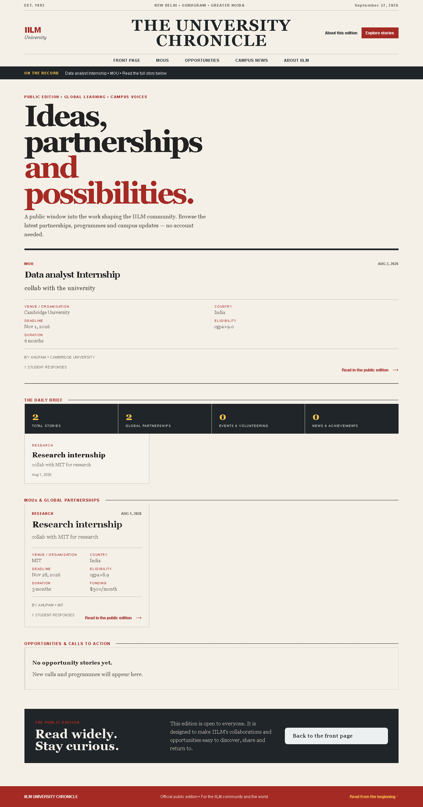

# IILM University Chronicle

The public-facing edition of the IILM MOU and opportunities portal. It presents partnerships, programmes and campus updates as a small, readable university newspaper.

## Open the site

- [Public edition on GitHub Pages](https://anupam-banerjee-2002.github.io/IILM-website/)
- [Repository](https://github.com/Anupam-Banerjee-2002/IILM-website)
- [Pages deployment status](https://github.com/Anupam-Banerjee-2002/IILM-website/actions/workflows/deploy-pages.yml)

The public edition is intentionally open: visitors can read the stories without signing in or requesting access. When the Node server is available, the page reads its latest stories from MongoDB. When it is being served as a static GitHub Pages site, it uses a small editorial sample so the page remains useful without a backend connection.

## Interface preview

### Front page



### Mobile reading view


## What is included

- Public newspaper-style front page for MOUs, research, exchanges, workshops and campus news.
- Public API endpoint at `/api/posts/public` for the live edition.
- Express and MongoDB backend with student, teacher and admin dashboards.
- JWT authentication for the private management features; it is not needed to read the public edition.
- GitHub Actions workflow that publishes `public/` to GitHub Pages.
- Render blueprint for running the Node and MongoDB-backed server as a web service.

## Run locally

Requirements: Node.js 14+ and MongoDB 4.4+ (local or Atlas).

```powershell
npm install
Copy-Item .env.example .env
npm start
```

Then open [http://localhost:5000](http://localhost:5000). The backend health check is available at [http://localhost:5000/api/health](http://localhost:5000/api/health).

For automatic restarts during development:

```powershell
npm run dev
```

## Deploy the backend

1. Create a MongoDB Atlas database and keep its connection string ready.
2. In Render, choose **New > Blueprint** and select this repository.
3. Add the Atlas connection string as `MONGODB_URI` when Render prompts for it. `JWT_SECRET` is generated by the blueprint.
4. Use the resulting service URL as the backend URL for any separate frontend deployment.

The service exposes `/api/health` for deployment checks. Never commit `.env`, database credentials or production secrets.

## Project layout

```text
public/                 Browser pages, styles and client-side scripts
server/                 Express server, routes, models and database config
.github/workflows/      GitHub Pages deployment
render.yaml             Render backend blueprint
```

## License

This project is released under the MIT license.
